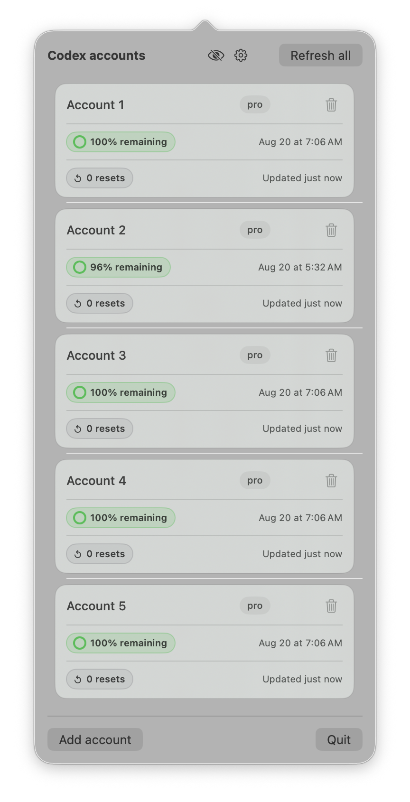
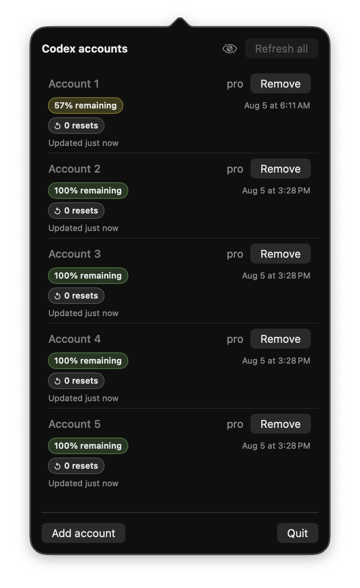

# CodexSwitch

A small native macOS menu-bar companion for checking Codex quota status across
multiple ChatGPT accounts.

Sometimes, when you use more than one Codex account, you just want a quick
answer: how much quota is left, when does it reset, and are reset credits
available? CodexSwitch keeps those answers one click away.

<p>
  
  
</p>

## What it shows

- The remaining percentage for the Codex quota.
- The next reset date and time returned by Codex.
- Earned reset credits, including `0 resets` when the account reports the
  feature but has none available.
- The plan and a whole-minute "Updated" timestamp.

The menu refreshes when it opens, and also supports a manual refresh and
per-account retry.

## Designed for sharing safely

Use the eye button in the menu to enter share view. It replaces email addresses
with `Account 1`, `Account 2`, and so on. In that view, an account label can be
renamed inline without changing the account, its refresh data, or Codex
authentication.

## Privacy and data handling

CodexSwitch uses the documented local `codex app-server` interface for browser
sign-in and quota reads. It stores only local profile metadata and non-secret
quota snapshots. It never asks for a password, API key, copied browser cookie,
or OAuth token, and it never reads or modifies Codex authentication files.

It is a display-only dashboard: it does not switch, launch, or terminate Codex
sessions.

## Install

1. Download `CodexSwitch-<version>.dmg` from the [latest GitHub
   Release](https://github.com/potapenko/codex-switch/releases/latest).
2. Open the disk image and drag `CodexSwitch.app` to Applications.
3. Open CodexSwitch from Applications and add the Codex accounts you want to
   monitor.

Public releases are signed with an Apple Developer ID and notarized by Apple.
Each release includes a ZIP archive, `SHA256SUMS.txt`, and a release manifest.

For release setup and local packaging checks, see [Releasing CodexSwitch](docs/releasing.md).

## Development

Requirements:

- macOS 14 or later
- A current `codex` executable available on `PATH`
- Xcode

Build and launch the app:

```sh
./script/build_and_run.sh --verify
```

Run the test suite:

```sh
xcodebuild -project CodexSwitch.xcodeproj -scheme CodexSwitch -destination 'platform=macOS' test
```

## License

[MIT](LICENSE)
